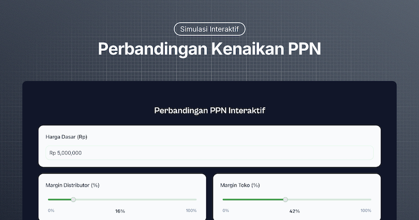

# VAT Simulator



An interactive Value Added Tax (PPN) comparison tool built with Next.js 15, React 19, TypeScript, and Shadcn UI. This application helps users understand the impact of different VAT rates on consumer prices across the supply chain.

## Getting Started

1. Clone the repository:
```bash
git clone https://github.com/jurnalanas/vat-simulator.git
cd vat-simulator
```

2. Install dependencies:
```bash
bun install
```

3. Start the development server:
```bash
bun dev
```

4. Open [http://localhost:3000](http://localhost:3000) with your browser to see the result.

## Contributing

Contributions are welcome! Please feel free to submit a Pull Request. For major changes, please open an issue first to discuss what you would like to change.

## Acknowledgments

Built with ❤️ by [Anas](https://x.com/oianas_)
